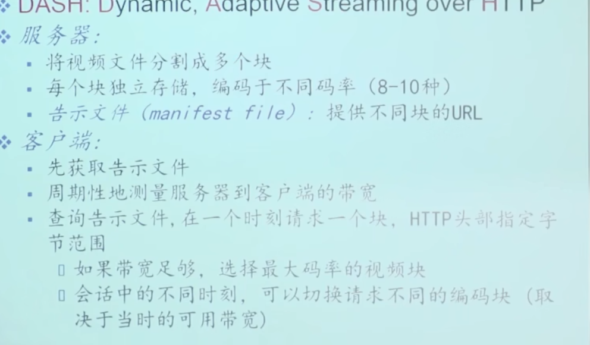

如何向数百万的用户提供并发的视频流服务？ CDN应运而生

# 什么是视频？
---
- 固定速度显示的图像序列
  
压缩视频：视频的冗余度：
- **空间冗余**：图像内部有很多相似的像素点
- **时间冗余**，相邻的帧之间有很多相似的像素点

## DASH 流化服务
---
 网络中一边下，一边播放。播放和下载是并行的。
不需要完全下载完在观看。

服务器会把视频分成很多段，每一段又分为不同的清晰度。
告示文件：把这些不同的段都分配好URL。 因此 客户端通过告示文件可以根据自身的带宽，网络情况来动态调整视频清晰度。

 
# CDN （Content Distriubtion Network）
---
如果是靠一台服务器来提供服务，那么服务的质量不高
- 跳数过多，传输过程中的网络带宽无法确定。
- 中心故障

**CDN核心思想： 就近访问**

**CDN**指 服务器预先把资源放在全国各地的Cache服务器上，当用户访问资源时，通过**DNS**的重定向或者视频资源的告示文件，就近选择cache服务器提供服务。 这就是CDN，加速访问。

## CDN提供服务案例

- 首先浏览器访问目标域名
- 浏览器通过本地域名解析器开始解析域名，查找到目标域名的解析器后，目标域名的解析器会返回**一个CDN运营商的域名**给浏览器（DNS的重定向）
- 本地浏览器访问CDN运营商的域名后，CDN运营商的域名解析器会返回一个**就近的Cache服务器的IP地址**给浏览器
- 浏览器访问Cache服务器的IP地址，Cache服务器会返回目标资源给浏览器

