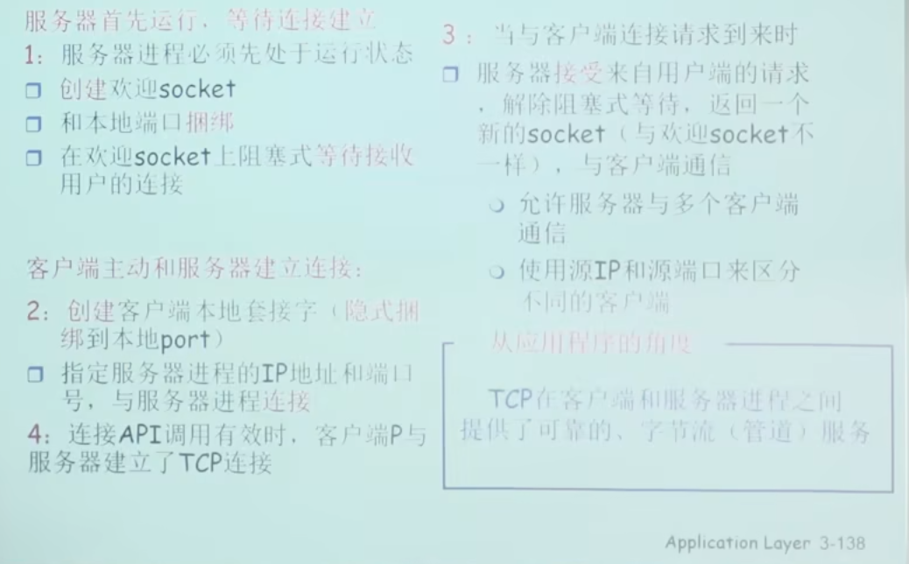
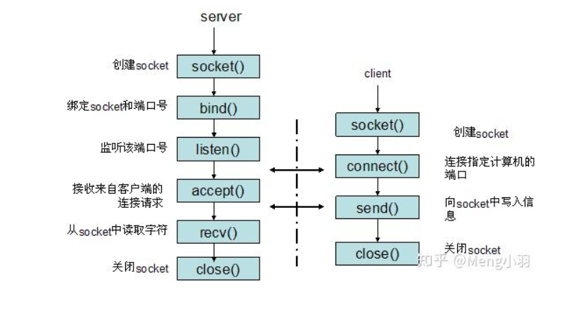

我们如何实现两个应用层交换数据的呢？
**通过传输层提供的接口，那就是socket api**

# TCP套接字编程
---

**Socket是什么？**
- 在TCP协议中，Socket是一个**四元组**（IP地址，端口号，目的地IP，目的地端口），用来唯一的标识TCP连接。

- 我们经常把 socket api 翻译为套接字，socket api是在应用层和传输层之间的一个抽象层，它把 TCP/IP 层复杂的操作抽象为几个简单的接口供应用层调用已实现进程在网络中通信。



**Server流程**：
- 创建一个welcomesocket，空值
- welcomeSocket 绑定 本地端口
- Socket等待 客户端连接，**阻塞**程序。
- 客户端连接后，取消阻塞并创建一个新的socket，用来和客户端通信。welcomeSocket继续用来等待客户端连接。（**客户端连接后，最好的方式是创造一个新的进程实现交互，主进程仍然等待新的连接**。 在这一点上，GO语言天然契合。）
- 接收数据，和客户端交互
- 交互完闭后，关闭Socket，关闭连接。 
  
**Client流程**：
- 创建一个socket，隐式的绑定了自己的ip，port
- Socket绑定服务器的ip，port
- 发送数据，和客户端交互



go语言的实现：

**Server**
```go
func process(conn net.Conn) {
	// 处理完关闭连接
	defer conn.Close()

	// 针对当前连接做发送和接受操作
	for {
		reader := bufio.NewReader(conn)
		// 缓存区，提高读取效率
        var buf [128]byte
		n, err := reader.Read(buf[:])
		if err != nil {
			fmt.Printf("read from conn failed, err:%v\n", err)
			break
		}

		recv := string(buf[:n])
		fmt.Printf("收到的数据：%v\n", recv)

		// 将接受到的数据返回给客户端
		_, err = conn.Write([]byte("ok"))
		if err != nil {
			fmt.Printf("write from conn failed, err:%v\n", err)
			break
		}
	}
}

func main() {
	// 流程的第一步和第二步。创建welcome socket并绑定   建立 tcp 服务
	listen, err := net.Listen("tcp", "127.0.0.1:9090")
	if err != nil {
		fmt.Printf("listen failed, err:%v\n", err)
		return
	}

	for {
		// 第三步阻塞，等待客户端建立连接
		conn, err := listen.Accept()
		if err != nil {
			fmt.Printf("accept failed, err:%v\n", err)
			continue
		}
		// 第四步 启动一个单独的 goroutine 去处理连接
		go process(conn)
	}
}
```

```go
package main

import (
	"bufio"
	"fmt"
	"net"
	"os"
	"strings"
)

func main() {
	// 第一步和第二步、与服务端建立连接
	conn, err := net.Dial("tcp", "127.0.0.1:9090")
	if err != nil {
		fmt.Printf("conn server failed, err:%v\n", err)
		return
	}
	// 2、第三步 使用 conn 连接进行数据的发送和接收
	input := bufio.NewReader(os.Stdin)
	for {
		s, _ := input.ReadString('\n')
		s = strings.TrimSpace(s)
		if strings.ToUpper(s) == "Q" {
			return
		}

		_, err = conn.Write([]byte(s))
		if err != nil {
			fmt.Printf("send failed, err:%v\n", err)
			return
		}
		// 从服务端接收回复消息
		var buf [1024]byte
		n, err := conn.Read(buf[:])
		if err != nil {
			fmt.Printf("read failed:%v\n", err)
			return
		}
		fmt.Printf("收到服务端回复:%v\n", string(buf[:n]))
	}
}
```

# UDP socket
- UDP 没有握手，即没有等待连接。
- 发送端明确指定目标端口+ip

```go
package main

import (
	"fmt"
	"net"
)

func main() {
	// 建立服务
	listen, err := net.DialUDP("udp", nil, &net.UDPAddr{
		IP:   net.IPv4(0, 0, 0, 0),
		Port: 9090,
	})
	if err != nil {
		fmt.Printf("listen udp server error:%v\n", err)
	}
	defer listen.Close()

	// 发送数据
	sendData := []byte("Hello server")
	_, err = listen.Write(sendData) // 发送数据
	if err != nil {
		fmt.Println("发送数据失败，err:", err)
		return
	}

	// 接收数据
	data := make([]byte, 4096)
	n, remoteAddr, err := listen.ReadFromUDP(data) // 接收数据
	if err != nil {
		fmt.Println("接收数据失败，err:", err)
		return
	}
	fmt.Printf("recv:%v addr:%v count:%v\n", string(data[:n]), remoteAddr, n)
}
```


