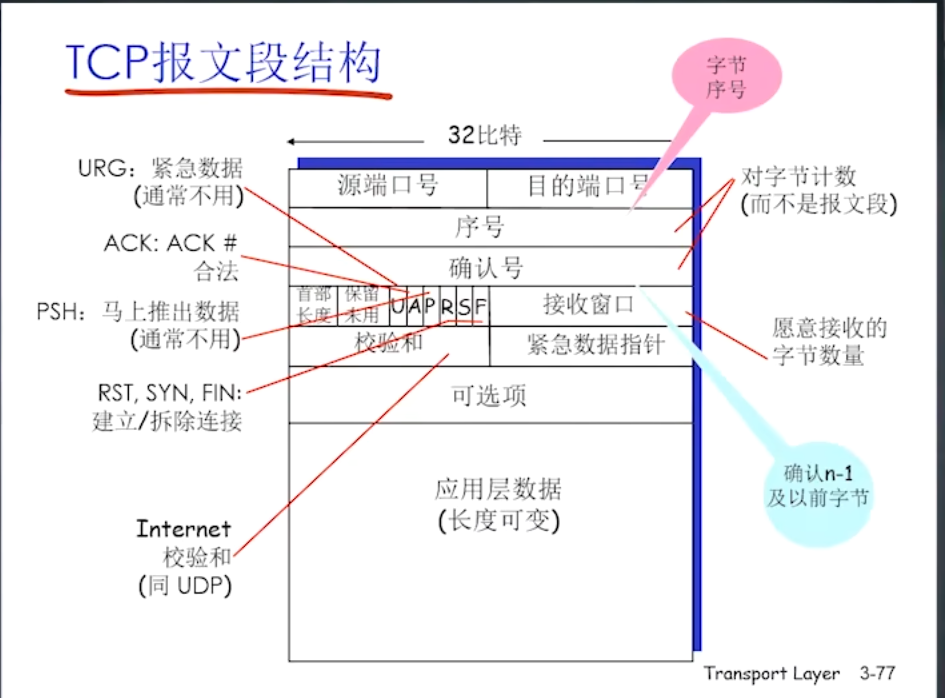
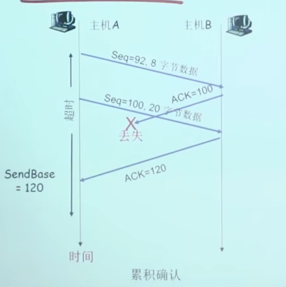
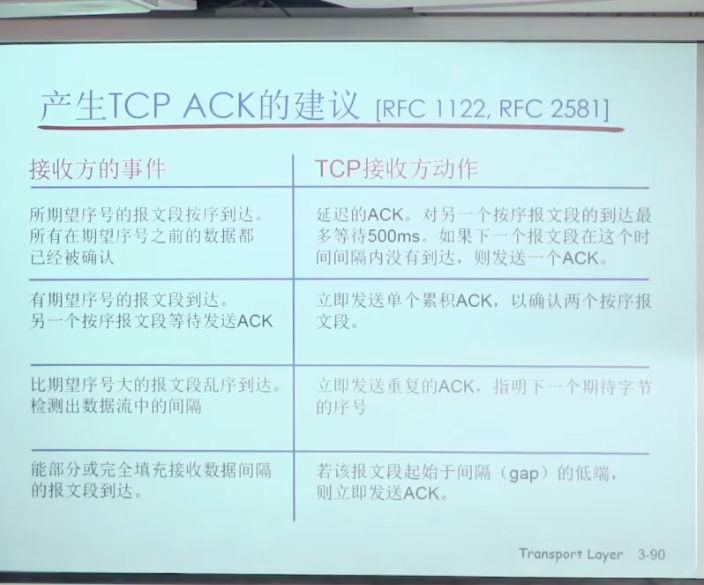
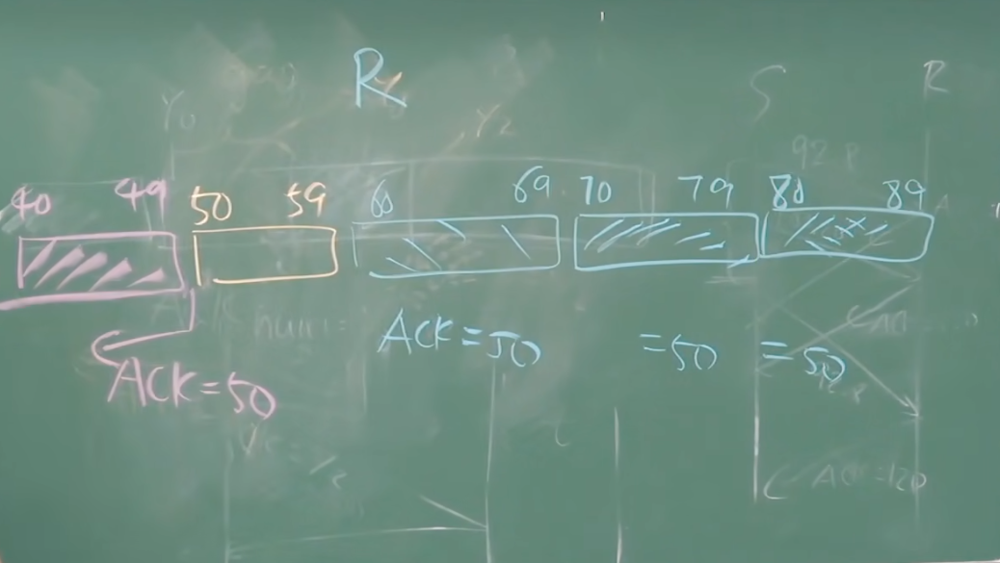
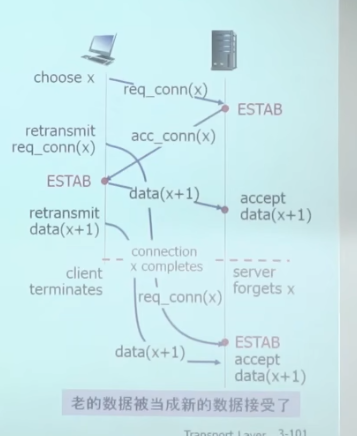
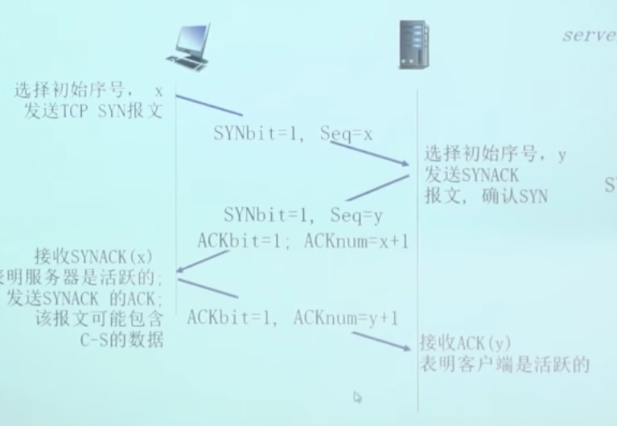
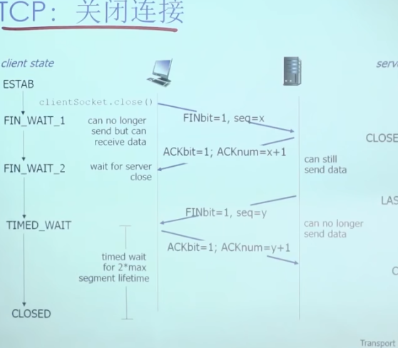

`TCP保证数据完整，有序，不丢失，不重复，原原本本，但是TCP不提供报文之间的界限，需要应用层子自己定义`

# 基本名词
---
## MSS 
MSS = MTU - IP头 - TCP头
MTU是最大传输单元，也就是一次传输数据的最大长度。 因为应用数据分别在传输层和网络层封装了TCP头和IP头，所以MSS = MTU - IP头 - TCP头

MSS就是应用层提供的最大数据长度。如果数据过大，则需要分为多个MSS传输。

# TCP报文结构
---

## 序号
前文中提到应用层数据被划分为多个MSS段序。TCP中的序号就是指本TCP的mss的第一个字节在整个应用层数据中的offset。
## ACK
TCP中的ack例如为 555 ，则告诉对方我已经接到到了554及以前的数据。类比RDT中的ACK，少了1. 在RDT中，若ACK是555 ACK是指收到了555及以前的数据。‘

## TCP的超时重发
应用之间的TC瓦往返时间分布很广，需要动态的调整超时时间。

# TCP的可靠数据传输 （GBN 和 SR 的混合体）
- TCP仅仅维护一个定时器，规定着最先发出去的段。（GBN 的影子）
- TCP超时后，仅仅只重传最先发出去的段。（SR 的影子）
- 快速重传：  当收到三个重复的ACK时，立即重传，即使超时控制器还没法到时间。

## 例子
**接收方法发送最新已经接收的数据+1 的ACK，代表期待的数据。**，`累积确认`

>同时接收方可以通过累积确认可以减少对发送方的打扰，设置一个辅助的ACK计时器，如果计时器规定时间内第二个tcp段到达，那么就累积确认，发组最新的ack，否则，就发第一个tcp段的ack。（顺序到来）

## 快速重传
`当收到三个重复的ACK时，立即重传，即使超时控制器还没法到时间。
`
接收方会对最后一个已收到的有序报文段进行确认，当连续回复三个相同的确认消息时，说明其下一个报文段丢失了，发送方执行快重传
- 例子

收到冗余的ACK，代表中间的分组丢失了，而且后面的连续的分组有三个都已经收到了。

# 流量控制
TCP报文中有接收窗口的字段，告诉发送方，自己还有多少的缓存空间，告诉发送方最多能发送多少的数据。

# TCP连接
连接的本质就是分配好TCP连接所需要的资源。
> 例如发送数据的初始位置，分配receive buffer等，定时器等。

## 三次握手的必要性
### 为什么两次握手不行？
`什么是两次握手` ：互相发送SYN（发送方 hello），ACK（接收方收到SYN后 hello）。 

局限性：
- 导致服务器维护了虚假半连接，消耗服务器的资源；当服务器的ACK在网络中`滞留`后，导致发送方超时定时器重传。 此时服务器会收到两次的SYN，服务器就会`重复分配资源`，维护了一个虚假的半连接。（对服务器来说在两次握手里面，我只需要接受到SYN,发送ACK　连接就确立，我就要维护数据）
  
- 在存在半链接的基础上，如果也超时重发了数据段，那么此时在服务端眼里，存在链接，也发送来了数据，就会吧该数据当作新的数据存储．

### 三次握手
 
`数据的传递和第三次握手是同时进行的。`

双方都选择自己发送的数据的初始序号（ACK开始的序号）告诉对方并确认收到,最少都要三次握手.这就是三次握手的由来.
 
###　三次握手是怎么解决半连接和接受老数据问题的
- 解决半连接：当发送方重复的发送SYN的时候，服务端会很乐意的建立链接，因为是三次握手，因此发送ACK给发送方，接收到发送方的数据（即第三次握手的数据时），才会维护连接状态．　但是此时，发送方接收到ＡＣＫ后不会发送数据给接收方，因连接已经处理完毕．

－　解决接受老数据：如果一个数据在网络中逗留了许久后到达目的地，此时如果连接已经结束，则可以直接丢弃这个数据（因为三次握手不存在半连接）　但是如果连接还存在：
> 为了避免老数据影响新的连接数据传递．需要判断这个连接是老连接还是新连接．这就是初始序号的作用．通过初始序号就能判断出这个数据是属于老连接还是新连接．可能出错，但是３２位中随机选取，出错的概率太小．　

## 连接释放
对称释放，但是并不完美

最后会设置一个定时器，如果规定时间内没有收到数据，则真正释放连接。