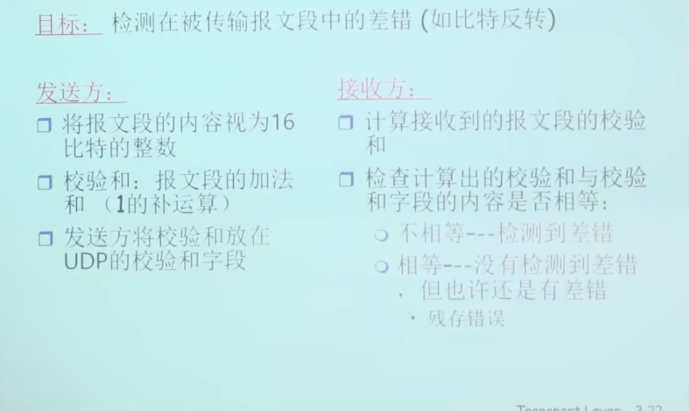

UDP仅仅在IP上完成了复用和解复用的过程和进程到进程的区分。除此之外，没有额外功能。

# UDP报文的组成
---

头部仅仅只有8个字节

# 为什么要有UDP
---
- UDP没有连接，自然没有连接延迟
- UDP简单，不需要在发送端和接收端维护连接状态（TCP后续还要接触握手，麻烦）
- 报文段很小，TCP有20字节，UDP只有8字节。传输开销小。
- 没有拥塞控制以及流量控制，因此UDP可以尽可能的发送报文段， 应用的传输效率近似于网络的速率

# EDC 校验和
---

具体的校验和算法：
把数据部分分为多个16bit的段，然后把这些段给加起来，求反码得到校验和。

细节：
- 进位要回卷，把它加到16位的最末位
- 因为校验和和 数据部分计算得到的是反码，因此直接执行想加，答案是16位全1,则说明一致。通过校验
> 残存错误： 内容出现错误，但是正好是校验和正确的。