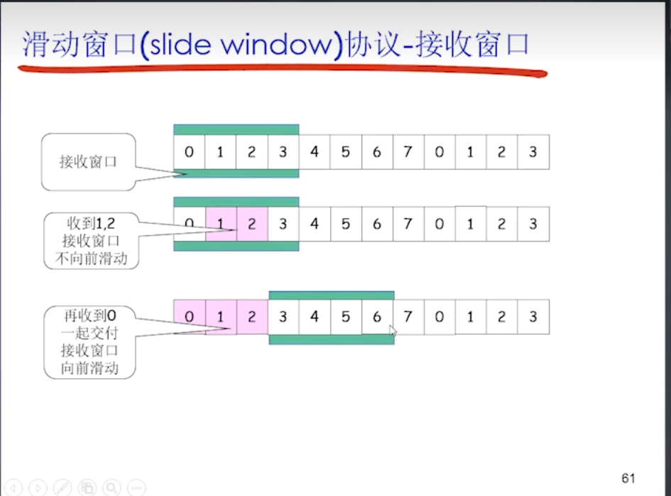
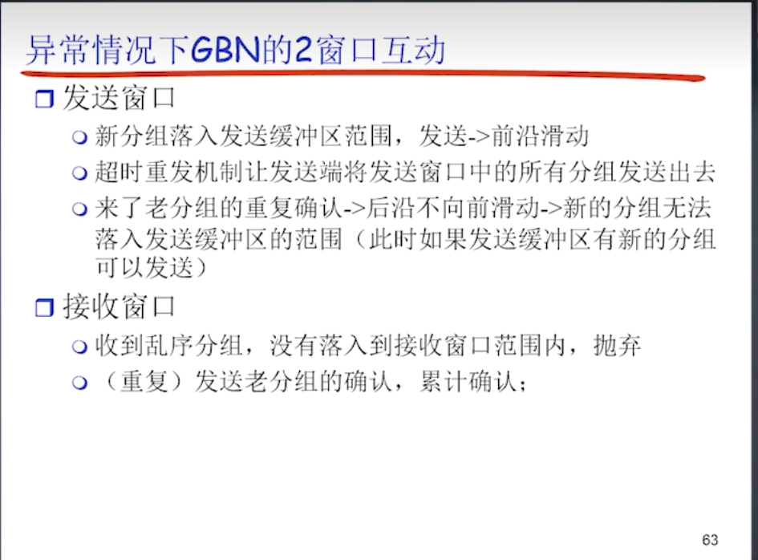
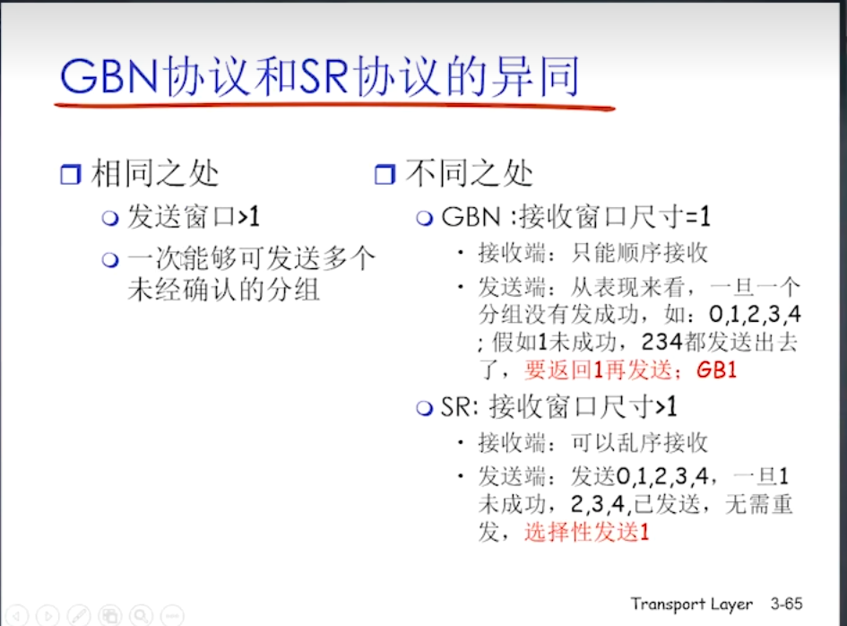
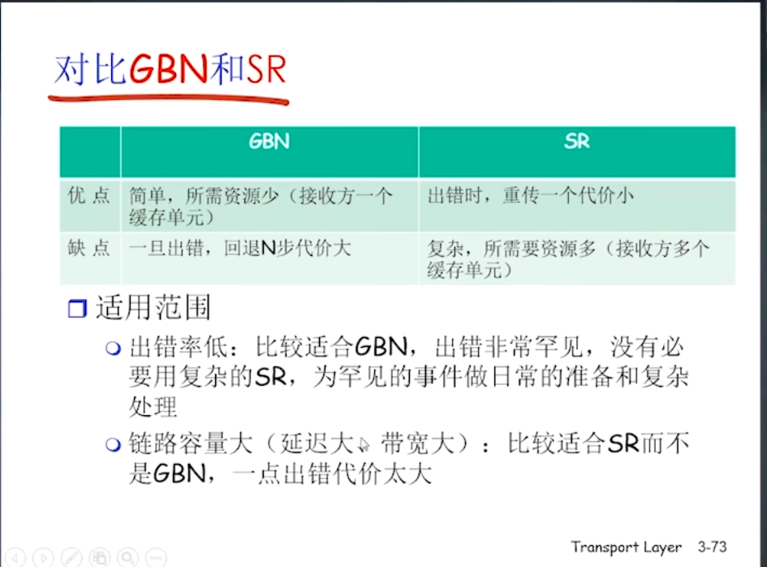

 `可靠数据传输可在链路层,网络层,传输层实现 top to down 所以在传输层介绍`
# rdt(可靠数据传输)介绍
---
- rdt1.0 假设下层信道是可靠的，不会出错，那么只需要在发送方发送数据后等待接收方确认即可。 主要完成封装解封装的工作
- rdt2.0 假设下层信道是不可靠的，可能会出错。 发送方主要完成差错检测和重传的工作
> `发送data应用数据时，计算机信道之间是单向的，但是信道是双向的法发送法和接收方可以交流数据，实现协议`

> rdt2.0时，发送方需要完成：对EDC的计算和副本保，等待接收方的ACK信息确认消息无误后传输下一个数据，否则的话，重传。 接法方需要完成对EDC的校验。 存在缺陷：**ACK，NAK数据也可能发生bit反转**，导致双方处于混乱状态。 2.1`在package中添加序号信息`，这样当接收方收到重复序号package时，重新发送ACK。在**发送方角度：如果ack，nak出错，直接重发就行了** 同时解决了接收方重复package问题 

> rdt2.2版本的时候，**直接移除了NAK** 对ACK进行了编号，用对前面一个分组的肯定来代替对当边的ACK的否定。（“那男的有钱吗？ -但他很老实”）

- rdt3.0  超时重传机制： 发送方的分组在传输过程中丢失后，发送方和接收方会形成死锁等待，此时需要定时器。

> rdt都是stop and wait机制。 则很大的网络带宽仅仅能利用一个分组，带宽利用率及其低（相当于一条高速公路只能行使一辆车）。 所以出现了流水线机制。

# 流水线机制
---
## 滑动窗口
`滑动窗口是流水线机制的核心`

发送方：
- 发送缓存区：存将将要发送或已法发送的数据
- 发送缓存窗口：发送缓存区的一部分，存储已经发送但没接收到确认信息的分组。大小有限制，最大只能使带宽利用率到100%

> 一开始 没有一个分组，窗口后沿等于前沿，每发送一个分组，前沿加1，每收到一个确认分组，后沿加1。

接收方：
- 接收缓存窗口 == 接收缓存区： 如果窗口长度为1，那么只能接收当前等待的分组，**不能接收其他分组。**。 如果长度大于1,那么可以接收**窗口内部**的所有分组，不必是窗口后沿。
> 接收窗口长度为1,则是GBN(go back n step)协议，只能顺序的接收。
> 接收窗口长度大于1,则是SR（选择性重传）协议，允许乱序接收。 而且分组的ACK各自分法发送，不是累积发送。

**虽然SR可以乱序接收，但是不能上前滑动，只有顺序接收后（保证顺序），才能解封装交给应用层,想前滑动**

### 异常情况下的GBN 2窗口互动
异常情况： 分组丢失； 接收方的ack丢失 造成数据的**乱序到达**
维护**一个窗口计时器**

当接收方没有收到后沿的ACK时，触发超时重传机制，接收方会把窗口的**所有数据都重新发送一遍**

### 异常情况下的SR 2窗口互动
每发送一个分组，都会维护一个计时器。
因此异常情况下，只需要重传丢失的分组即可。

### GBN SR的异同

