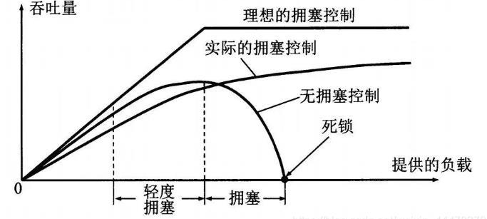

# 拥塞的代价
- 网络的延迟随着流量强度的增加而趋近于无穷大，(排队延迟和丢包重传)

- 为了要网络达到目标的泵出，需要加快输入速率

- 在网络拥塞时，因为加快输入速率，会导致更多的排队和丢包重传，导致更多的延迟，从而导致网络更坏．　不加控制的话，很快失控变坏．

- 拥塞时，如果分组被丢弃，那么就会导致上游的传输能力被浪费掉．传输能力在拥塞时十分宝贵．

理想中:吞吐量随着网络输入速率增大而增大
实际上: 因为路由器的buffer是有限的,出现很多重传的分组.而且输入速率越快,重传的分组越多.
如果没有拥塞控制 甚至会死锁,网络中读取不到数据.

# 控制拥塞的两种方法
- 由网络信息辅助的控制
-　端对端的控制  (由系统自己对网络的测量调整发送速率)

## ATM 网络信息辅助的例子
ATM的基本发送数据为 信元,它有NI和CI,ER三个标志位. 分别代表轻微拥塞,拥塞,网络链路中最小的传输速率. 发送端可以通过这三个动态的调整发送速率.

## TCP 端对端 例子
端对端,路由器的负担较轻.
