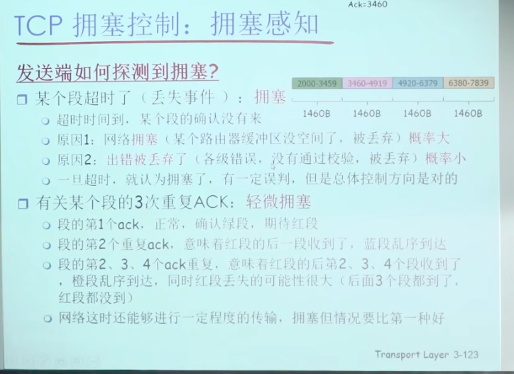
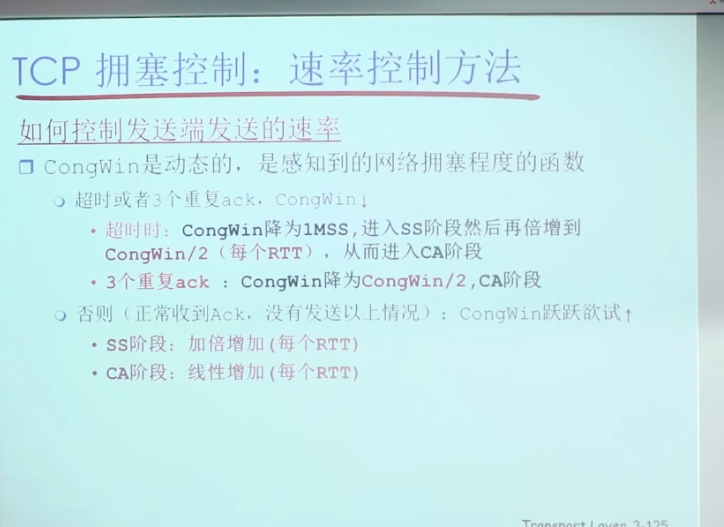
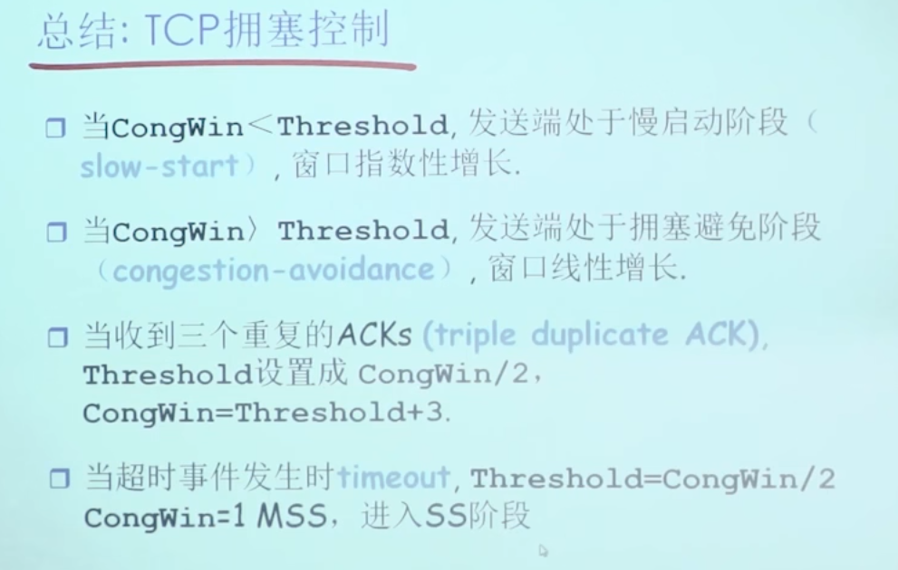

# 拥塞的代价
- 网络的延迟随着流量强度的增加而趋近于无穷大，(排队延迟和丢包重传)

- 为了要网络达到目标的泵出，需要加快输入速率

- 在网络拥塞时，因为加快输入速率，会导致更多的排队和丢包重传，导致更多的延迟，从而导致网络更坏．　不加控制的话，很快失控变坏．

- 拥塞时，如果分组被丢弃，那么就会导致上游的传输能力被浪费掉．传输能力在拥塞时十分宝贵．

理想中:吞吐量随着网络输入速率增大而增大
实际上: 因为路由器的buffer是有限的,出现很多重传的分组.而且输入速率越快,重传的分组越多.
如果没有拥塞控制 甚至会死锁,网络中读取不到数据.

# 控制拥塞的两种方法
- 由网络信息辅助的控制
-　端对端的控制  (由系统自己对网络的测量调整发送速率)

## ATM 网络信息辅助的例子
ATM的基本发送数据为 信元,它有NI和CI,ER三个标志位. 分别代表轻微拥塞,拥塞,网络链路中最小的传输速率. 发送端可以通过这三个动态的调整发送速率.

# TCP 端对端 例子
端对端,对网络的拥塞检测由TCP来负责检测.路由器的负担较轻.
TCP如何检测网络的拥塞?

## 发送速率
CONGWIN 拥塞窗口，**拥塞控制窗口的大小决定了发送端在接收到确认之前可以发送的数据量**

Ｒate = CONGWIN / RTT

CongWin是动态的，
慢启动阶段：　一开始为１，　每次收到ACK　就加倍．

- 初始化：

> 当TCP连接建立时，拥塞控制窗口的大小通常被初始化为一个较小的值（例如，1个MSS，即最大段大小）。

- 慢启动（Slow Start）：

> 在连接开始时，发送端以较小的窗口大小发送数据，并逐渐增加窗口大小。每收到一个确认（ACK），窗口大小增加1倍。
这种指数增长的方式称为慢启动，因为它在开始时增长较慢，但随着时间的推移，增长速度会加快。

- 拥塞避免（Congestion Avoidance）：

>当拥塞控制窗口达到一个阈值（慢启动阈值，ssthresh）时，慢启动阶段结束，进入拥塞避免阶段。
在拥塞避免阶段，窗口大小以线性方式增长，每收到一个确认，窗口大小增加1/CWND个MSS。

- 拥塞检测与恢复：

>当发送端检测到数据包丢失（例如，通过超时或重复确认），它会认为网络发生了拥塞。
发送端会减小拥塞控制窗口的大小，并重新进入慢启动或拥塞避免阶段。具体来说是在超时的时候，进入慢启动阶段，从１开始启动．重复确认直接进入拥塞避免阶段．
具体来说，拥塞控制窗口会减半（乘以0.5），并且慢启动阈值也会设置为当前窗口大小的一半。

- 快速重传与快速恢复（Fast Retransmit and Fast Recovery）：

>当发送端收到三个重复的确认（即三个相同的ACK）时，它会认为某个数据包丢失，并立即重传该数据包，而不等待超时。
在快速恢复阶段，拥塞控制窗口会减半，但不会重新进入慢启动阶段(不会重新从１开始)，而是继续以线性方式增加窗口大小。

## 拥塞控制和流量控制的联合
**TCP在未确认的情况下能发送的数据量　就是　CongWin　和 接收方的接收缓存的空闲值的最小值．**

